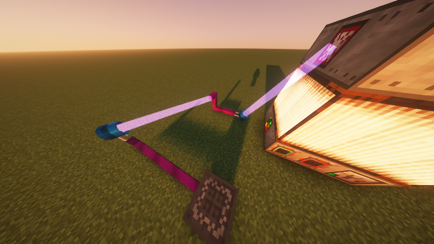
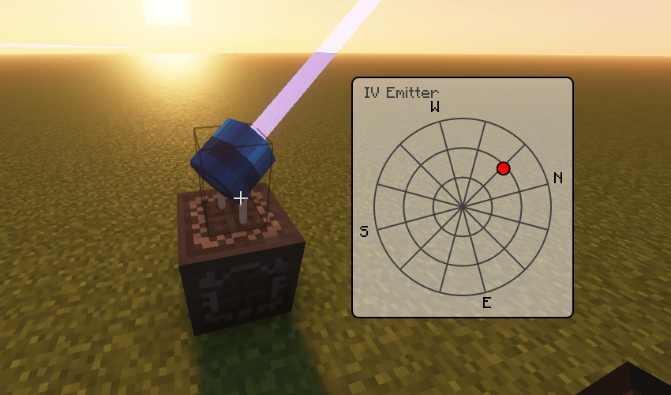

# GregTech Placeable Emitters
This is a GregTech addon mod that makes the "Emitter" items placeable in-world. When powered, placed emitter blocks shoot beam that transfers energy to the block it hits.\
\
All tiers of emitters transfer at the rate of 1 A. When idling, they still drain 1 EU/t. There is currently no distance-based loss and no range limit, besides that beams stop at unloaded chunks.

The angle of placed emitters can be adjusted in its GUI. However, they can't bend more than 90° away from their default direction.\

## Implementation
This mod is written in an unconventional way: it is written in Rust. The Rust code is [here](native/src). It uses JNI and JVMTI to interact with Java objects. The only Java code in this mod is for loading the compiled native binary into memory.
